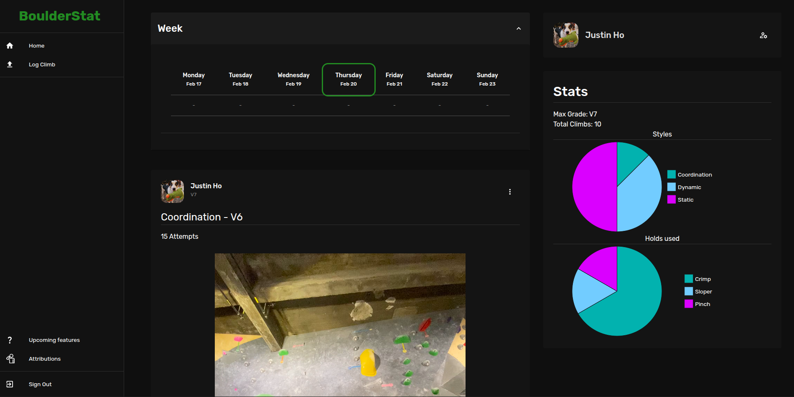

Live Link: https://boulderstat.com

# Things that I learned

- For token authentication and refreshing, need to handle cases when access / id token becomes invalid, can wrap fetch function with a function that checks for unauthorized response, if so refresh the token. If using axios you can use intercepters instead to check for the unauthorized response and then refresh.

- Data fetching from an api requires multiple features to be efficient such as caching, making data stale (Keeping data up to date), response handling for success, loading, and error. React query makes this much easier, it can keep track of each data fetched from an api through a key, and this can be fetched or invalidated anywhere in the application.

- Creating a seperate staging environment will make development the application easier much, as the frontend can plug directly into it and changes are instant with HMR. Backend can be tested without affecting the main application.

- Putting all dependencies into a lambda layer will make updating the lambda function much faster if updating dependencies is not needed.

- Compressing media will make the website load much faster. 55 MB to 8 MB will make a big difference when multiple videos are being loaded.

- IOS Safari will not generate thumbnails for video elements. You can use media fragments (append #t=0.001 at the end of the url), to display the thumbnail. It is telling the browser to skip the first millisecond, which allows IOS Safari to preload the thumbnail.

# About the project

## Frontend

S3 bucket, Cloudfront. (Uses MUI and inline styling)  

## Backend

API Gateway into lambda with serverless-express, S3 bucket to store media, MongoDB to store user data  

Using React Query, the api data is fetch and stored along with a key, when fetching the same key, we get the cached result instead of sending the same request. Data will expire (become stale), after some time, or can become invalidated (mutations will invalidate their respective data.)

## Authentication

Cognito to manage Authentication, using OAuth2 flow. Getting authentiation code from hosted ui, sending request to token endpoint to get the tokens. Storing refresh token in a secure cookie to get new tokens if they expire.  

## Media upload / storage

Hit backend endpoint to get presigned url, use this to upload. Use object url to get media as the bucket is public.  

S3 bucket uses the Cognito user id as a folder name for each user to store images / videos.  

## Staging environment.

Uses seperate cloudfront distribution and s3 bucket

Seperate API Gateway stages

Seperate lambda

Same user pool with different app client

## Notes

npm run dev to run frontend, connected to staging backend (loads in the env file assuming you have it)
push.sh to push to production / staging to update frontend and or backend on AWS.

## WIP

https://trello.com/b/1NERCnDG/climbing-app  
